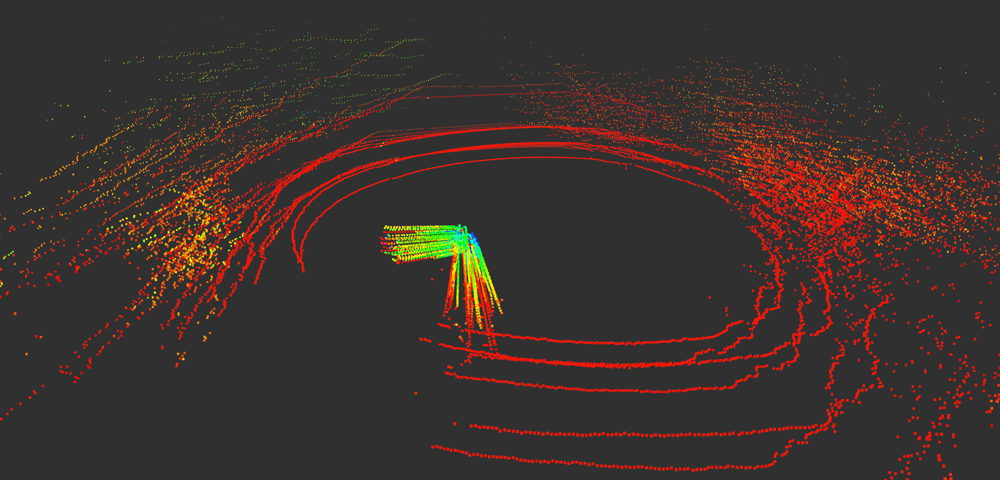

<!--
 * @Author: Shuai Wang
 * @Github: https://github.com/wsustcid
 * @Version: 1.0.0
 * @Date: 2020-05-18 09:34:05
 * @LastEditTime: 2020-06-03 09:20:14
--> 

# Exploring Udacity’s Open-Source Lidar Data
Reference: <https://medium.com/@peter_moran/exploring-udacitys-open-source-lidar-data-c61f485b0a3>


## Setup
### Dataset Download
[Udacity’s dataset library](https://github.com/udacity/self-driving-car/tree/master/datasets) includes a variety of sensor logs primarily used for their Self-Driving Car Challenge, which you can read all about from [Oliver Cameron’s writeup](https://medium.com/udacity/open-sourcing-3½-hours-of-driving-data-with-lidar-b9258496a78b).

For my purposes, there are two datasets of interest which each contain camera, GPS, lidar, and steering/throttle/brake data. The driving data is stored in ROS bags and are downloaded via the torrent links found below.
  1. The [first dataset](https://github.com/udacity/self-driving-car/tree/master/datasets/CHX), `CHX_001`, is a small (1.5 GB) recording of a lap around the block at the Udacity office, which is great for getting started since it won't take long to download.
  2. The [second dataset](https://github.com/udacity/self-driving-car/tree/master/datasets/CH3), `CH03_002`, contains a large (60.1 GB) continuous recording of a trip on the El Camino Real highway from the Udacity office to San Francisco.

***As noted, the lidar data for both of these logs come from a Velodyne HDL-32E.***

After downloading, you can extract these files to anywhere. Personally, I put them in a new folder : `/media/ubuntu16/Documents/Datasets/Udacity/`.

### Software Installation
**ROS.** To view the data, you will need ROS Indigo (though Kinetic *may* work). I already had this installed, but if you are following along, you can find the [ROS Indigo install guide](http://wiki.ros.org/indigo/Installation) on their website, and should follow up that guide by [creating your catkin workspace](http://wiki.ros.org/catkin/Tutorials/create_a_workspace).

**Playback Script.** You will also need to download the files used for playing back the data in ROS. The ROS package containing these files are found in the `datasets/udacity_launch/` folder in Udacity's [self-driving-car](https://github.com/udacity/self-driving-car) repository. To properly install this, use the following steps:

Download Udacity’s self-driving-car repository and copy the `udacity_launch` folder to the `src` folder of your ROS catkin workspace. 

```
git clone https://github.com/udacity/self-driving-car 
cp -r ./self-driving-car/datasets/udacity_launch/ ~/catkin_ws/src/
```

Register `udacity_launch` with ROS via `catkin_make`.

```
source ~/catkin_ws/devel/setup.bash
cd ~/catkin_ws 
catkin_make 
source ./devel/setup.sh
```

(Optional) If you don’t want to run `setup.sh` in every new terminal where you use a ROS command, you should also add `setup.bash` to your `~/.bashrc`. Some ROS guides may have already had you do this.

```
echo source ~/catkin_ws/devel/setup.bash >> ~/.bashrc
```

------

## Exploration
### Viewing the Dashboard Video
Once you have one of the datasets downloaded, ROS installed, and `udacity_launch` set up in your catkin workspace, you can easily view the videos stored in each log with the following steps.

Open the terminal and start ROS.

```
roscore
```

In a second terminal, navigate to your dataset and start publishing it over ROS.

```
cd ~/udacity-driving-data/CHX_001 
rosbag play --clock *.bag
```

In a third terminal, start playback via `udacity_launch`.

```
roslaunch udacity_launch bag_play.launch
```

In a fourth terminal, start rviz to visualize the data.

```
roslaunch udacity_launch rviz.launch
```

If everything works, rviz will open just as below, showing the videos from the car’s three front facing cameras. If you get any errors, make sure you have run `source ~/catkin_ws/devel/setup.bash` in every terminal by hand or via your `~/.bashrc`.


### Viewing the Lidar Data
Visualizing the lidar point cloud ended up being a bit more difficult than the videos, since Udacity does not provide much support for it. In fact, I still don’t have it working entirely!

If you look at `udacity_launch/launch/bag_play.launch`, you can see that there are two optional arguments that have to do with lidar, `velodyne_packet2pointcloud` and `velodyne_packets2pointcloud`, which run specific ROS nodes from the `velodyne_decoder` or `velodyne_pointcloud` ROS packages, respectively.

However, if you try to run `bag_play.launch` with either of these arguments true, it will probably not work because ROS does not come with the `velodyne_decoder` or `velodyne_pointcloud` packages. I couldn't find any documentation about this from Udacity, so after a bit of digging around on the internet I was able to find the `velodyne_pointcloud` package, which is just part of the larger `velodyne` ROS package. I was not able to figure out what `velodyne_decoder` was, so I went ahead using `bag_play.launch` with only the `velodyne_packet2pointcloud` argument.

Hoping that everything would now work, I installed the `velodyne` ROS package, ran `bag_play.launch` with `velodyne_packets2pointcloud:=True`, and re-configured rviz to display the point cloud data. **This didn't work too well, so don't install the velodyne package just yet.** As you can see below, while the point cloud seems to generally be correct, it also curves upwards the further away from the car the points are, forming something like a giant funnel.


This seemed like a calibration problem. Looking at `bag_play.launch` again, I noticed the following line, where we could change the calibration file.

```
<param name="calibration" value="$(find velodyne_pointcloud)/params/VLP16db.yaml"/>
```
*Aha! That’s not the right Velodyne device. The datasets said they were recorded on the Velodyne HDL-32E, the Velodyne VLP-16 is a different lidar sensor, so maybe we just need to change this to the correct one. But, Udacity does not provide any calibration file, and if you navigate to the `params` folder by running `roscd velodyne_pointcloud/params/`, you will see there is no HDL-32E calibration file. Further investigation online showed that the reason for this is that HDL-32E calibration file is not included in the current public release of the `velodyne` package. Instead, if you need that file you should build it from source. I'll discuss that next.*

### The Best Results, so far

**Fixing the calibration file.** With some troubleshooting out of the way, we now know that in order to properly visualize the lidar point cloud, we need to install the `velodyne` ROS package [from source](https://github.com/ros-drivers/velodyne) and use the HDL-32E calibration file. You can do this by:

```python
cd ~/catkin_workspace/src
git clone https://github.com/ros-drivers/velodyne.git
cd ~/catkin_ws
catkin_make
source ./devel/setup.sh

"""
Solving catkin error:
A generally useful way to install all the dependencies of everything in your catkin workspace that's not already resolved within that workspace:

cd ~/catkin_ws
rosdep install --from-paths src --ignore-src --rosdistro indigo -y

pkg wiki: http://wiki.ros.org/velodyne_pointcloud
"""
```

Then open `~/catkin_workspace/src/udacity_launch/launch/bag_play.launch` and change the line

```
<param name="calibration" value="$(find velodyne_pointcloud)/params/VLP16db.yaml"/>
```

to

```
<param name="calibration" value="$(find velodyne_pointcloud)/params/64e_utexas.yaml"/>
```

> **PS:** There are actually two HDL-32E calibration files. Th file`64e_utexas.yaml` is by The University of Texas. Another one, called `64e_s2.1-sztaki.yaml`, can be found in the same folder, but did not seem to work as well.

**Changing rviz settings.** When you run `rviz.launch` it opens rviz to show the camera video only, as defined by `udacity_launch/rviz/disp.rviz`, so even if the point cloud data was properly published you would not see it until you added the point cloud to the list of things to visualize as well as tune a few other settings. To save you some time, you can download this [new copy of ](https://gist.github.com/peter-moran/d49f8f6488d715258035ced29ee2acd4)`disp.rivz` and replace the old one to easily visualize the point cloud data.

**Displaying the Point Cloud.** Now we are ready to visualize everything. We need to run all four terminals from earlier again, but this time with `velodyne_packets2pointcloud:=True` for `bag_play.launch`, as below.

```
# Terminal 1
roscore

# Terminal 2
cd ~/udacity-driving-data/CHX_001
rosbag play --clock *.bag

# Terminal 3
roslaunch udacity_launch bag_play.launch velodyne_packets2pointcloud:=True

# Terminal 4
roslaunch udacity_launch rviz.launch
```

Now with a proper calibration file, we the results below, which look a lot better. As you can see, the scan lines no longer curve upwards in the distance.


While things are better, they are not perfect. For example objects seem to warp as they pass by and some of the scan lines are floating out in the middle of space (particularly noticeable in the clip above). Flat surfaces, such as the side of a car, start to bend and curve, or even diverge into different directions. This especially significant when objects are close to the car and happens in the clip below.


### Visualizing Point Cloud from CH2
To visualize point cloud data in CHX and CH3, we have changed the bag_play file and saved the new bag_play launch file as bag_play_new.launch. However, to visualize point cloud in CH2, we do not need to change anything except the rviz.launch, since the lidar used in CH2 is vlp16!
The results using bag_play.launch (vlp16 calibration file)


The results using bag_paly_new.launch (vlp32 calibration file)



### Tools for handle pointcloud data
http://wiki.ros.org/pcl_ros#pointcloud_to_pcd

```python
# install pcl_ros (under the data folder)
sudo apt-get install ros-kinetic-pcl-ros

# play bag
rosbag play --clock *.bag

# covert velodyne raw packets msg to standard PointCloud2 message
roslaunch udacity_launch baplay.launch velodyne_packets2pointcloud:=True

# covert point cloud to pcd (under the to be saved folder)
rosrun pcl_ros pointcloud_to_pcd input:=/velodyne_points

```
## Conclusion

Seeing these results, it seems like further calibration or some form of processing is needed for the lidar.

For now, though, Udacity’s lidar data does not seem reliable or clean enough to confidently work with, especially for learning algorithms. Perhaps there is a missing configuration file, or additional pre-processing is needed, or perhaps there is something I am doing wrong, but since this is the beginning of my own exploration with lidar, I can’t be sure. **If you have any thoughts or useful experience, please share!** I don’t want to give up on this data set entirely and I’d still love to get it working.

